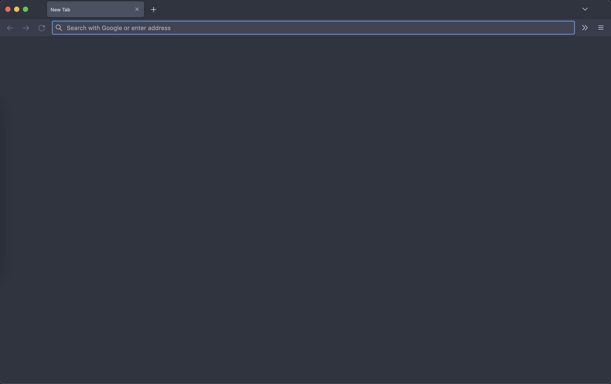

I am in love with Nord theme. After successfully moving my Terminal and Sublime Text 4 on MacOS, I wanted to change my browser as well. Firefox is so easy to customize that I decided I will go full Nord on it. So here is a preview of how it looks. I like very minimal setups and the color should be uniform. 



Here are the steps: 

1. Install the *Arc Dark Theme for Firefox*. That should setup the tabs and menu bar. 

2. The tabs and new windows are still light color, so I went ahead and changed the userContent.css and userChrome.css. This is how you do it. 

3. Procedure

    * Type about:config in the URL bar
    
    * Search toolkit.legacyUserProfileCustomizations.stylesheets and double-click the field to set it to true
    
    * Type about:support in the URL bar
    
    * Look for Profile folder field and click on the open button next to it.
    
    * Create a folder with the name chrome
    
    * Inside this folder, create a file userChrome.css and paste the following code inside it :

    ```
        tabbrowser tabpanels { background-color: rgb(46,52,64) !important; }
        browser { background-color: #2e3440 !important; } 
    ```

    * Then create another file userContent.css and paste the followind code in it :


    ```
        @-moz-document url-prefix("about:blank") {
            html > body:empty {
                background-color: rgb(46,52,64) !important;
            }
        }
        @-moz-document url("about:blank") {
            html > body:empty {
                background-color: rgb(46,52,64) !important;
            }
        }

        @-moz-document url("about:newtab"), url("about:home") {
          body {
            background-color: rgb(46,52,64) !important;
          }
        }   
    ```

4. Finally, set your Homepage and new windows to about:newtab

4. Completely quit and restart firefox

5. Enjoy
